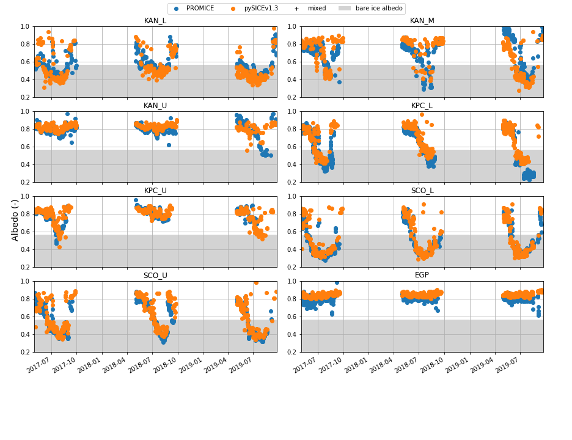

1. [Evaluation of pySICEv2.1](#pySICEv2.1)

    1.1 [vs PROMICE BBA](#pySICEv2.1_bba)

    1.2 [vs EastGrip SSA and d_opt](#pySICEv2.1_ssa)

2. [Evaluation of pySICEv1.3](#pySICEv1.3)

    2.1 [vs PROMICE BBA](#pySICEv1.3_bba)

    2.2 [vs EastGrip SSA and d_opt](#pySICEv1.3_ssa)
  
# Evaluation of pySICEv2.1 
## Against PROMICE broadband albedo observations

## Against SSA and grain diameter observations at EastGRIP

# Evaluation of pySICEv1.3

## Against PROMICE broadband albedo observations

## Against SSA and grain diameter observations at EastGRIP

